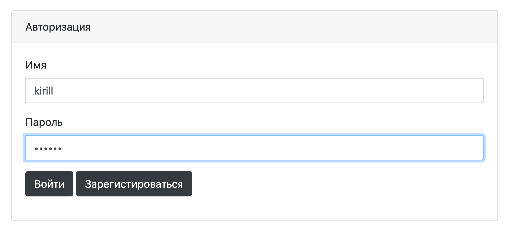

## Проект курса [job4j](http://job4j.ru)

### Приложение реализует площадку для отображения инцидентов на дороге

Технологии:
- PostgresSQL
- CRUDRepository
- Hibernate
- Jdbc
- Spring Boot / Security / Data
- Jackson
- Jsp / Jstl
- Log4j / Slf4j
- JUnit
- MVC / Singleton (On Demand Holder Idom)

Регистрация пользователя 

Авторизация пользователя

Добавление инцидента на дороге

Главная страница

Изменение инцидента

